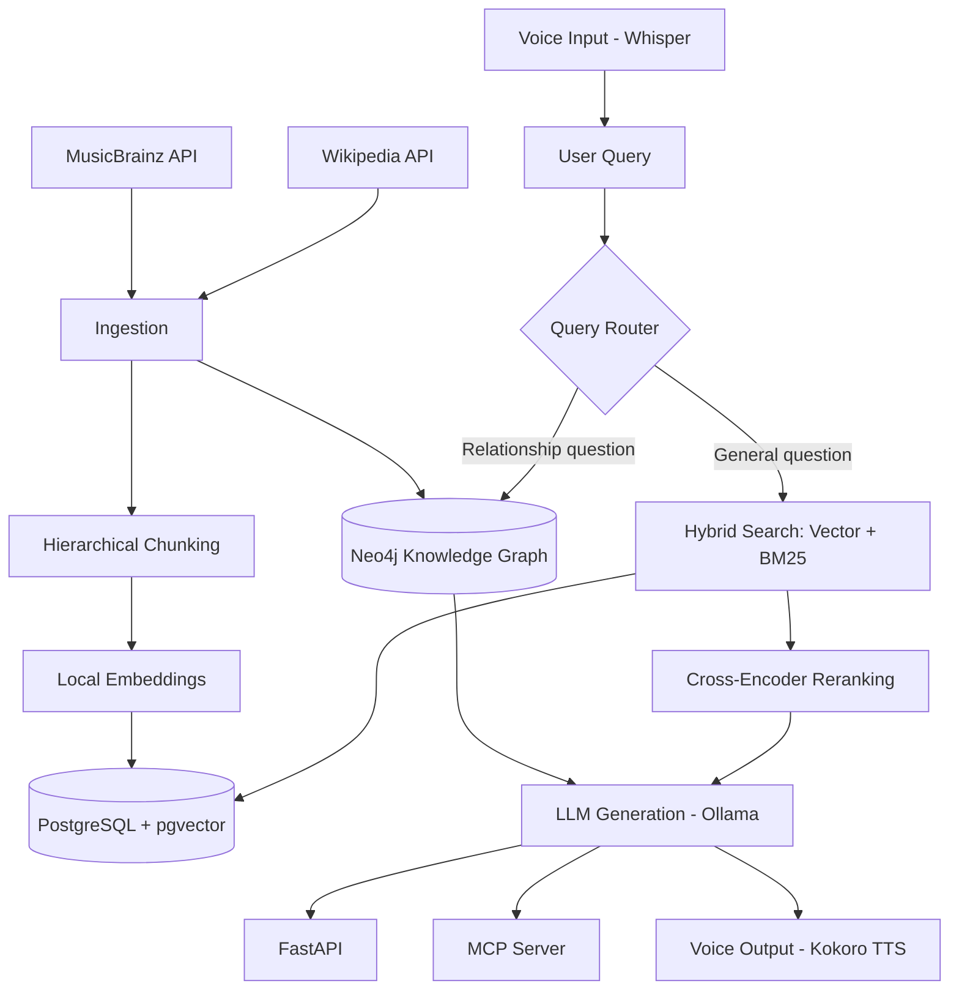
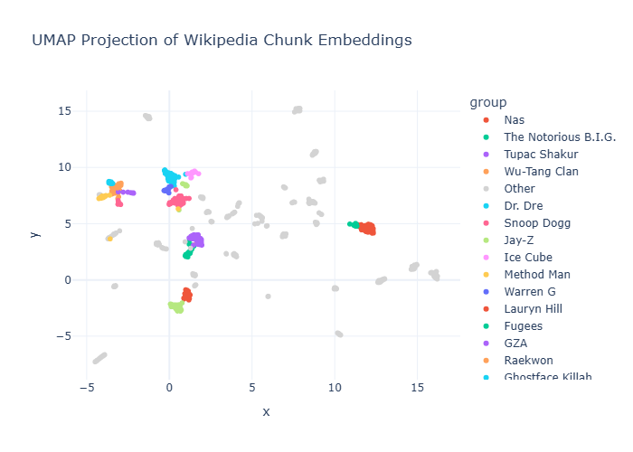

# Music RAG: A Hybrid GraphRAG System for 90s Hip-Hop

A full-stack Retrieval-Augmented Generation system combining vector search, sparse search, reranking, and knowledge-graph traversal to answer questions about 90s hip-hop artists - grounded in real MusicBrainz and Wikipedia data, served locally end-to-end.

Built as a portfolio project to demonstrate production-oriented RAG engineering: not just "call an embedding model," but chunking strategy, retrieval evaluation, hybrid fusion, graph-based retrieval, voice I/O, and CI/CD.

---

## Architecture



---

## What this project demonstrates

**Retrieval & vectorization**
- Hierarchical, token-aware chunking with overlap (section-first splitting, sentence-respecting fallback for oversized sections)
- Local embeddings via `sentence-transformers`
- Vector search (PostgreSQL + pgvector)
- Sparse search (BM25) and hybrid fusion via Reciprocal Rank Fusion, with tunable weighting
- Cross-encoder reranking
- **Measured, not assumed**: a real evaluation harness (precision@k / recall@k) across vector-only, hybrid, and reranked retrieval, run against a hand-built golden query set

**Knowledge graph**
- MusicBrainz artist relationships (collaborations, band membership, family ties) loaded into Neo4j as a real graph
- A query router that detects relationship-style questions and answers them via Cypher graph traversal instead of embedding search - directly addressing a measured weakness of pure vector retrieval on relationship queries

**LLM & voice**
- Local LLM generation via Ollama
- Speech-to-text via Whisper, with a fuzzy-matching correction layer against known artist names
- Text-to-speech via Kokoro (local, Apache-2.0 licensed)

**Interfaces & tooling**
- FastAPI HTTP service
- MCP server exposing retrieval, transcription, and speech synthesis as discoverable tools (validated via the official MCP Inspector)
- MLflow experiment tracking for retrieval-strategy comparisons
- CI/CD via GitHub Actions (automated test suite on every push)

---

## Results

Evaluated across a hand-built golden query set (precision@5 / recall@5, averaged):

| Strategy | Avg. Precision | Avg. Recall |
|---|---|---|
| Vector only | 0.25 | 0.35 |
| Hybrid (Vector + BM25) | 0.30 | 0.37 |
| Hybrid + Reranking | 0.30 | 0.40 |


**Key finding**: hybrid search improved retrieval on proper-noun-heavy queries (e.g. "Illmatic") but underperformed pure vector search on broad, low-keyword-specificity queries (e.g. "tell me about X's career") - traced to BM25 introducing noise when no distinctive term anchors the query. Reranking consistently matched-or-beat both baselines, making it the most reliable single addition. Full investigation, including root-causing a specific retrieval failure down to embedding behavior, is documented in the project's development history.

### Embedding space

A UMAP projection of chunk embeddings, colored by artist, shows clear semantic clustering - artists group tightly by shared vocabulary, era, and style (e.g. Wu-Tang Clan and its members cluster together; Lauryn Hill, stylistically distinct from pure hip-hop, sits well separated from the rest).



An interactive 3D version is available at `scripts/embedding_visualization_3d.html`.

---

## Tech stack

| Category | Tools |
|---|---|
| Ingestion | MusicBrainz API, Wikipedia API, `requests` |
| Chunking | `tiktoken`, custom hierarchical splitter |
| Embeddings | `sentence-transformers` (`all-MiniLM-L6-v2`) |
| Vector DB | PostgreSQL + pgvector |
| Graph DB | Neo4j |
| Sparse search | `rank_bm25` |
| Reranking | `sentence-transformers` cross-encoder |
| LLM | Ollama (`llama3.2`) |
| STT / TTS | OpenAI Whisper / Kokoro-82M |
| API | FastAPI |
| Tool protocol | MCP (Model Context Protocol) |
| Experiment tracking | MLflow |
| Testing / CI | pytest, GitHub Actions |
| Visualization | UMAP, Plotly |

---

## Project structure

```
music-rag/
├── data/
│   ├── raw/            # Untouched API responses
│   ├── processed/      # Cleaned, structured data
│   ├── chunks/          # Chunked text ready for embedding
│   └── embedding/       # Embedded chunks
├── src/
│   ├── config.py         # Shared config, DB connections
│   ├── ingestion.py       # MusicBrainz ingestion
│   ├── ingest_wikipedia.py
│   ├── parse.py           # MusicBrainz cleaning
│   ├── chunk_wikipedia.py # Hierarchical chunking
│   ├── embed_chunks.py
│   ├── retrieval.py       # Vector search
│   ├── hybrid_retrieval.py # BM25 + RRF
│   ├── rerank.py
│   ├── graph_load.py      # Neo4j data loading
│   ├── graph_search.py    # Graph traversal + entity matching
│   ├── router.py          # Query routing logic
│   ├── generation.py       # LLM prompt assembly + generation
│   ├── stt.py / tts.py
│   ├── api.py              # FastAPI app
│   ├── mcp_server.py       # MCP tool server
│   ├── metrics.py          # Pure eval logic (precision/recall/RRF)
│   └── eval.py             # Evaluation harness
├── scripts/
│   └── visualize_embeddings*.py
├── tests/
└── .github/workflows/    # CI pipeline
```

---

## Setup

```bash
git clone <repo-url>
cd music-rag
python -m venv venv
venv\Scripts\activate  # Windows
pip install -r requirements.txt
```

Requires: PostgreSQL with the pgvector extension, Neo4j (Desktop or server), Ollama with a pulled model (e.g. `llama3.2`), and a `.env` file (see `.env.example`) with database credentials.

Run the pipeline stages in order (ingestion → parsing → chunking → embedding → loading), then:

```bash
uvicorn src.api:app --reload
```

Visit `http://127.0.0.1:8000/docs` for the interactive API.

---

## Known limitations & next steps

- Hybrid search's BM25 component can hurt retrieval on broad, non-keyword-anchored queries - a query-type-aware weighting scheme is a natural next step
- Entity matching for graph queries uses substring matching against known artists; upgrading to NER (e.g. spaCy) would generalize better to open-vocabulary or misspelled mentions
- Only Wikipedia data is currently embedded into pgvector; MusicBrainz's structured metadata (tags, relations, release history) is loaded into Neo4j but not yet embedded as text
- No containerization yet (Docker Compose for Postgres + Neo4j + the API is planned)
- Single-turn only - no conversation memory across requests
- No groundedness/hallucination check beyond prompt instruction
- **LLM-as-judge groundedness checking has real limitations**: a small labeled evaluation (4 test cases) found the groundedness checker only agreed with expected verdicts 50% of the time. The failure mode is notable - the judge model sometimes hallucinates its own "supporting" facts not present in the context (e.g. confidently stating a specific award year that was never mentioned), rather than strictly evaluating only the literal text provided. This is a known, documented failure mode of LLM-as-judge approaches: the same model that can hallucinate as a generator can also hallucinate as a judge. A stricter prompt explicitly instructing the model to ignore outside knowledge is a natural next step, along with expanding the labeled test set for more reliable calibration.

---

## Why this domain

Built on 90s hip-hop rather than a generic corpus specifically to stress-test retrieval on proper-noun-heavy, relationship-dense data - album titles, collaborations, and band memberships are exactly the kind of content where naive vector search struggles and where hybrid search and graph retrieval earn their keep.
